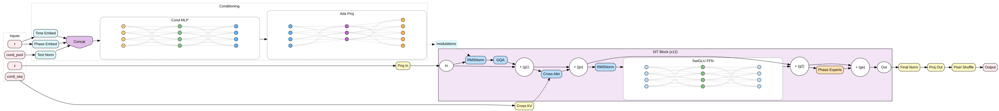
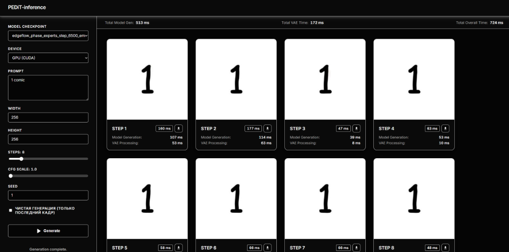
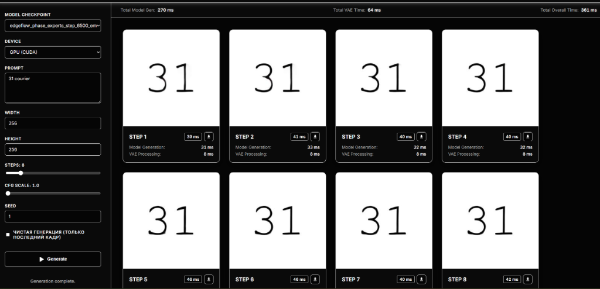
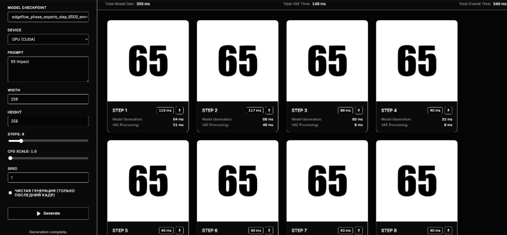

# PEDiT-100M (Phase EdgeFlow Diffusion Transformer)

PEDiT-100M is a compact diffusion model based on a Transformer architecture (DiT) with phase modulation (Phase Rectified Flow). With only ~100 million parameters, the network achieves sub-second inference on consumer GPUs such as the **NVIDIA GeForce RTX 3060** (300–500 ms per image).

Model checkpoints are openly available on Hugging Face: [AIT-FT/PEDiT-100M](https://huggingface.co/AIT-FT/PEDiT-100M).

All required assets (model weights in FP16, FP8, or INT8, the mT5 text encoder, and the TAESD VAE decoder) are downloaded automatically on first run.

---

## Architecture

The model is built upon a Diffusion Transformer backbone with dedicated phase conditioning and expert routing:



### Key Components:
* **DiT Blocks (x12)**: 12 transformer blocks featuring Grouped-Query Attention (GQA) and RMSNorm.
* **Phase Experts**: Phase-specific expert modules that adapt dynamically across diffusion stages, decoupling coarse structural composition from fine glyph detailing.
* **SwiGLU FFN**: SwiGLU activation functions within the feed-forward networks.
* **Adaptive Modulation (Ada Proj & Cond MLP)**: Concatenation of timestep embeddings, phase embeddings, and pooled text representations to modulate intermediate DiT features.
* **Ultra-fast VAE Decoder**: Lightweight TAESD decoder translating latent representations to RGB pixels in 8–50 ms.

---

## Current Training Stage & Capabilities

The model has been trained on a focused typographic rendering task: generating two-digit numbers from **1 to 99** in **5 distinct fonts**.

Accurate text rendering has historically been a significant challenge for diffusion models due to high sensitivity to small glyph artifacts. PEDiT-100M reliably preserves letterform geometry, stroke weights, and distinctive typographic styles.

### Supported Fonts:
1. **Arial (`arial`)** — Clean sans-serif grotesque.
2. **Times New Roman (`times`)** — Classic serif typeface with distinct brackets and serifs.
3. **Courier New (`courier`)** — Monospaced typewriter font.
4. **Comic Sans MS (`comic`)** — Informal handwritten style.
5. **Impact (`impact`)** — Condensed, ultra-bold display typeface.

### Out-of-Distribution Generalization (The "31" Experiment):
To prove that the architecture learns compositional rules rather than merely memorizing the training dataset, **the number "31" was deliberately excluded from the training data**.

The model was exposed to individual digits "1" and "3" and various other two-digit combinations, but **never saw an image of "31" during training**. At evaluation time, PEDiT-100M successfully rendered "31" across all 5 fonts, demonstrating true spatial and typographic compositionality.

### Prompt Format:
Prompts are specified by the target number and font keyword:
```text
1 comic
31 courier
65 impact
7 arial
42 times
```

---

## Proof of Work & Generation Latency

Below are unedited step-by-step generations captured directly from the Web UI running locally on a consumer **NVIDIA GeForce RTX 3060 (12 GB)** using **8 Euler steps**. Timings demonstrate a per-step latency of **30–45 ms** (total end-to-end latency: 360–540 ms).

### 1. Number 1 in Comic Sans MS (`1 comic`)
The soft, slanted stroke characteristic of Comic Sans clearly resolves by step 3:


### 2. Number 31 in Courier New (`31 courier`) — Zero-Shot Generalization
The number **31** was completely absent from the training set. The model correctly composes the numerals "3" and "1" with exact Courier New monospaced proportions and slab serifs.
* **Step Latency**: 31–33 ms per step
* **VAE Decode**: 8 ms
* **Total Latency**: **361 ms** (on RTX 3060)



### 3. Number 65 in Impact (`65 impact`)
Dense, heavy strokes and tight vertical proportion of Impact. Total generation time: ~540 ms on RTX 3060:


---

## Available Checkpoints

The Hugging Face repository provides three quantization tiers:
* **FP16** (`PEDiT-100M-FP16.pt`, ~206 MB) — Standard half-precision baseline with maximum fidelity.
* **FP8** (`PEDiT-100M-FP8.pt`, ~103 MB) — 8-bit floating point (E4M3), halving VRAM requirements with virtually no perceptual loss.
* **INT8** (`PEDiT-100M-INT8.pt`, ~103 MB) — Dynamic per-channel weight quantization for low-resource inference.

---

## Quick Start

### Windows
1. Clone the repository:
   ```cmd
   git clone https://github.com/AIT-FT/PEDiT-inference-100M.git
   cd PEDiT-inference-100M
   ```
2. Launch the Web UI:
   ```cmd
   run_server.bat
   ```
   Open your browser at: `http://localhost:8000`

3. Or run command-line inference:
   ```cmd
   run_inference.bat
   ```

### Linux / macOS
1. Clone the repository:
   ```bash
   git clone https://github.com/AIT-FT/PEDiT-inference-100M.git
   cd PEDiT-inference-100M
   chmod +x *.sh
   ```
2. Launch the Web UI:
   ```bash
   ./run_server.sh
   ```
   Open your browser at: `http://localhost:8000`

3. Or run command-line inference:
   ```bash
   ./run_inference.sh
   ```

---

## Model Downloads

Inference scripts automatically download required checkpoints on demand. You can also pre-fetch models manually:

* **Windows**: `download_models.bat`
* **Linux**: `./download_models.sh`

Or via CLI:
```bash
# Download a specific precision
python download_utils.py --model fp16
python download_utils.py --model fp8
python download_utils.py --model int8

# Download all variants
python download_utils.py --all
```

---

## Recommended Settings

* **Resolution**: 256x256 (native resolution for current checkpoint).
* **Sampling Steps**: 8 (Euler).
* **CFG Scale**: 1.0 (recommended for fastest inference) or 1.2–1.5 (for stricter typographic adherence).
* **Seed**: Any integer for reproducible results, or `-1` for random seeds.

---

## Repository Structure

* `server.py` — FastAPI server with WebSocket support for live step-by-step streaming.
* `inference.py` — Standalone command-line inference tool.
* `model.py` — `EdgeFlowPhaseV2` neural network architecture.
* `encoders.py` — mT5 text encoder and TAESD VAE loaders.
* `rectified_flow.py` — Phase Rectified Flow sampler.
* `download_utils.py` — Automated Hugging Face model downloader and integrity manager.
* `check_deps.py` — Dependency and virtual environment checker.
* `export_tensorrt.py` — TensorRT optimization pipeline.
* `static/` — Web UI frontend (`index.html`, `script.js`, `style.css`).
* `assets/` — Architecture diagrams and generation proof samples.

---

## License

This project is licensed under the Apache License 2.0.
